# Unsorted 

*IMPORTANT* - I've tried to attribute credit where credit is due according to 
where _I_ found the resource first.  If the credit is wrong, please raise a PR
or otherwise get in touch!

vs-underground Papers
https://www.vx-underground.org/windows.html

Network Basics for Hackers
https://www.hackers-arise.com/networks-basics

Full Ethical Hacking Course
https://www.youtube.com/watch?v=dz7Ntp7KQGA

Recommendations for Security+ Exam
>i f you are currently studying for the Security + exam, i would recommend the following:  
> * Professor Messler videos on YouTube
> * Jason Dion’s Security + training on Udemy
> * Darril Gibson’s “Get Certified Get Ahead” SY0-501 Study Guide 
Credit: https://twitter.com/techbaenisha/status/1564632055975223303?s=20&t=OBzCNt_niQROiDqf-8RJmQ

Making HTTP header injection critical via response queue poisoning
https://portswigger.net/research/making-http-header-injection-critical-via-response-queue-poisoning

SQL Cheat Sheet
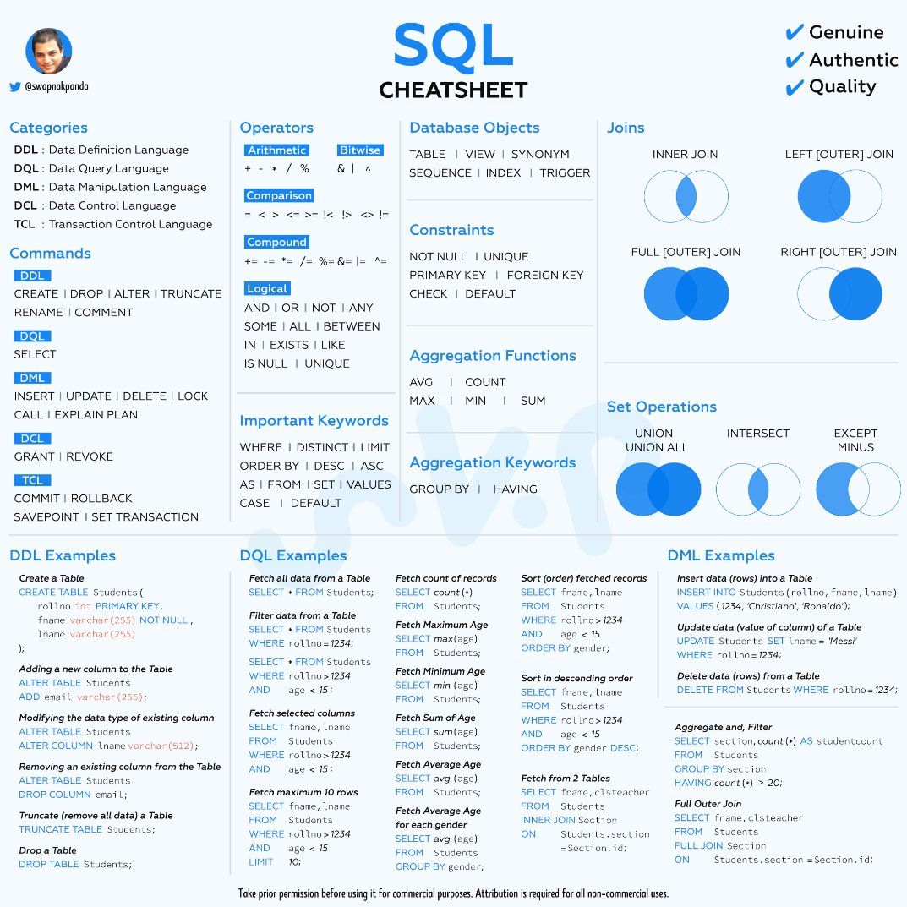
Credit: https://twitter.com/swapnakpanda/status/1566740489608790016?s=20&t=OBzCNt_niQROiDqf-8RJmQ

Securing the Supply Chain of Nothing
https://kellyshortridge.com/blog/posts/securing-the-supply-chain-of-nothing/

OSINT Resources
https://start.me/p/rx6Qj8/nixintel-s-osint-resource-list

All the OSINT You Can Get From a Single Webpage Request
https://www.spiderfoot.net/all-the-osint-you-can-get-from-a-single-webpage-request/

Java Strings
> Java Strings are specified with power-31 polynomial hashcode, which means adding "Aa" and "BB" to existing String produces two different Strings with same hashcode. Repeat recursively if you need more collisions. Easy and useful for hashcode sensitivity tests.
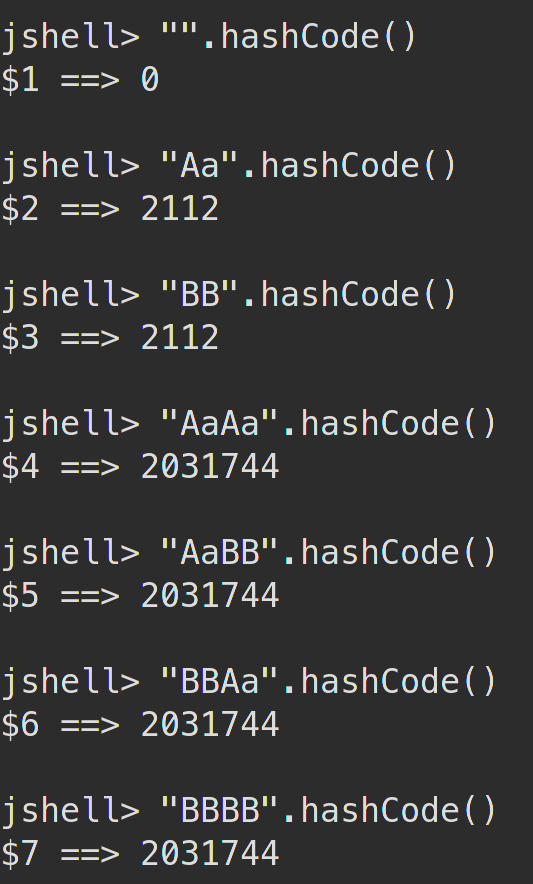
Credit: https://twitter.com/shipilev/status/1561637440938541056?s=20&t=OBzCNt_niQROiDqf-8RJmQ

OSINT: Who owns this mobile number?
> OSINT pro tip. If you are trying to find out the owner of a cell number, run it against a paym0ent app like Cash App where cell numbers are often paired with names
[Credit](https://twitter.com/shad0wbits/status/1579280435410268160?s=20&t=D0p-ZP4RKMFuT4Gm8tRu3g)

Book: [Cyber Security for Small Networks](https://nostarch.com/cybersecurity-small-networks)

JSON Web Tokents
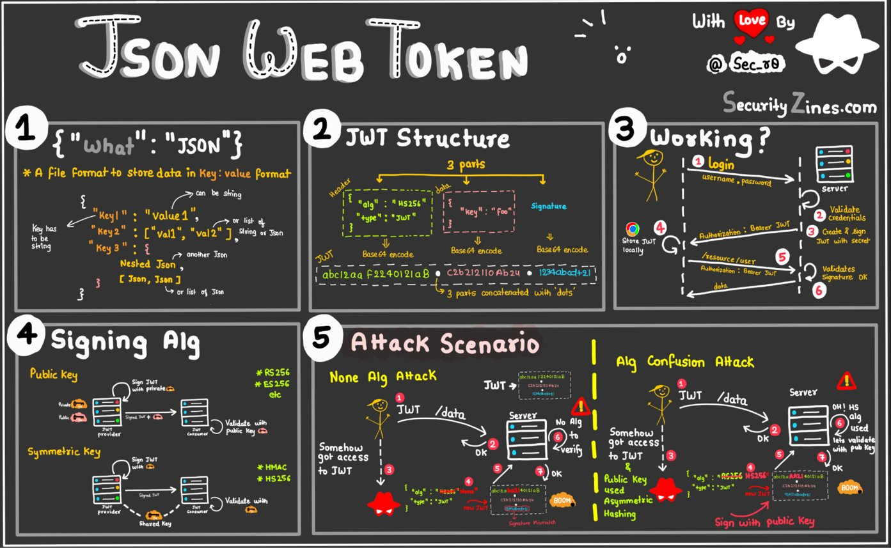
[Credit](https://twitter.com/sec_r0/status/1574081491948150784?s=20&t=D0p-ZP4RKMFuT4Gm8tRu3g)

Burp Sweet info
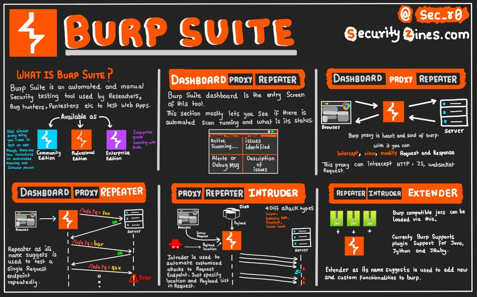
[Credit](https://twitter.com/sec_r0/status/1567922946374516739?s=20&t=OBzCNt_niQROiDqf-8RJmQ)

Video: [James Webb JPEG With Malware](https://isc.sans.edu/diary/29012)

Book: 101 Things I Learned in Architecture School

Article: [The Metadata Trap](https://theintercept.com/2019/08/04/whistleblowers-surveillance-fbi-trump/)

Video: [What happens when a k8s cluster started](https://www.youtube.com/shorts/aB0zE-gzgkY)

Video: [Preparing for OSCP Exam with AD](https://www.youtube.com/watch?v=griDEeIcXQc)

Resource: [Visualise JSON files](https://jsoncrack.com/)

Java Cheat Sheet
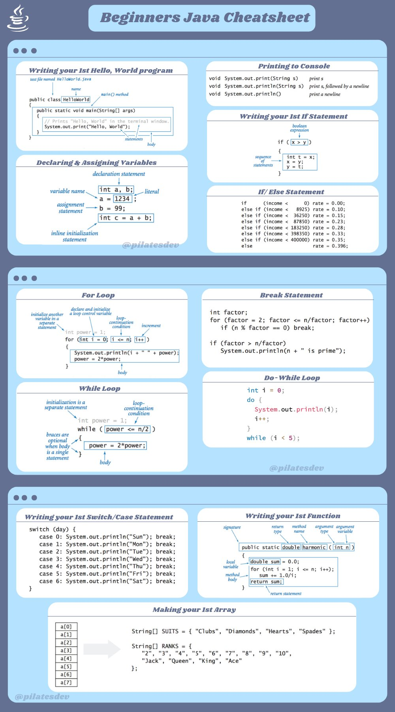
[Credit](https://twitter.com/pilatesdev/status/1566838136054988800/photo/1)

Article: [Spring4Shell: Security Analysis](https://www.lunasec.io/docs/blog/spring-rce-vulnerabilities/)

OSINT: Geolocating hints
- [Geo Hints](https://geohints.com/)
- [Landmark Recognition](https://landmark.toolpie.com/)
- [Bruecken Web](https://www.brueckenweb.de/2content/suchen/suche.php)
[Credit](https://twitter.com/ohshint_/status/1565802445175140352?s=20&t=OBzCNt_niQROiDqf-8RJmQ)

Video: [Setting up HAK5 WiFi Coconut](https://www.youtube.com/watch?v=AeDOlkrEWU4)

Video: [How I Became a Network Engineer at Cisco](https://www.youtube.com/watch?v=MbTEOkku3Rg)

Video: [DNS Tunneling]( https://twitter.com/i/status/1525487050186694657)

Paper: [Monitoring and Tuning the Linux Network Stack: Sending Data](https://blog.packagecloud.io/monitoring-tuning-linux-networking-stack-sending-data/)

Paper: [Monitoring and Tuning the Linux Network Stack: Receiving Data](https://blog.packagecloud.io/monitoring-tuning-linux-networking-stack-sending-data/)

[Pentesting Bible](https://github.com/oxfemale/PENTESTING-BIBLE)

Pentest Tip:
>Pentest tip: Leave Pcredz, Impacket SMB server, Responder (Analyze mode), etc running all the time. You never know when a random Domain Admin will try to auth to you over NTLM. 
>
>Very typical with agentless security products.
[Credit](https://twitter.com/n00py1/status/1577045510036557824?s=20&t=D0p-ZP4RKMFuT4Gm8tRu3g)

Training: [Python for Defenders](https://learn.taggart-tech.com/p/python-for-defenders-pt1)

Article: [Browser In The Browser (BITB) Attach](https://mrd0x.com/browser-in-the-browser-phishing-attack/)

Article: [Exploiting XSS with Javascript/JPEG Polyglot
](https://systemweakness.com/exploiting-xss-with-javascript-jpeg-polyglot-4cff06f8201a)

Training: [Beginner's TypeScript](https://www.totaltypescript.com/tutorials/beginners-typescript)

Article: [Bypassing Amazon WAF to pop an alert()
](https://infosecwriteups.com/bypassing-amazon-waf-to-pop-an-alert-4646ce35554e)

Cheat Sheet: Linux Filesystem Structure
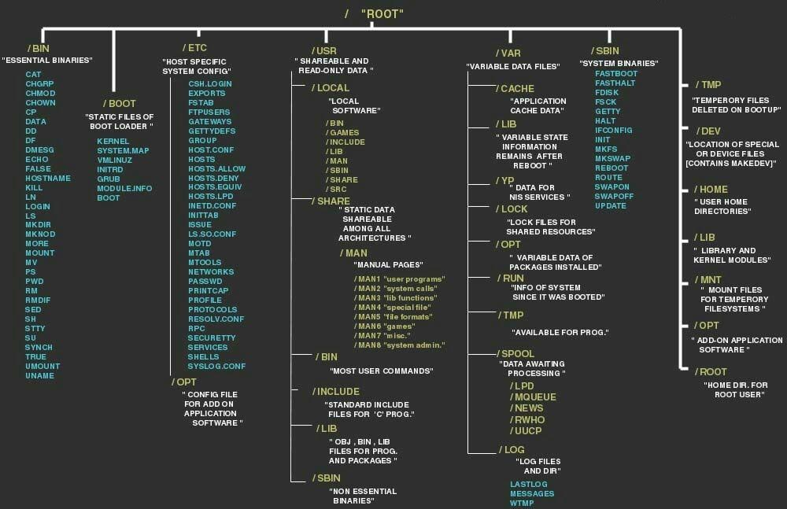
[Credit](https://twitter.com/linuxopsys/status/1570902869779550208?s=20&t=qUBknUxyULxEtnFGMXM7EQ)

Programming: [Coding Game](https://www.codingame.com/start)

Programming: [Codewars](https://www.codewars.com/)

Programming: [Cryptozombies](https://cryptozombies.io/)

Programming: [Robocode](https://robocode-dev.github.io/tank-royale/)

Programming: [Untrusted](https://alexnisnevich.github.io/untrusted/)

Programming: [SQL Murder Mystery](https://mystery.knightlab.com/)


Article: [A Cyber Threat Intelligence Self-Study Plan: Part 1]( https://medium.com/katies-five-cents/a-cyber-threat-intelligence-self-study-plan-part-1-968b5a8daf9a)

Article: [A Cyber Threat Intelligence Self-Study Plan: Part 2](https://medium.com/katies-five-cents/a-cyber-threat-intelligence-self-study-plan-part-2-d04b7a529d36)

Books: 20 Lessons from 20 Books

[Credit: Library Mindset](https://twitter.com/librarymindset/status/1572082393250672640?s=20&t=qUBknUxyULxEtnFGMXM7EQ)

Books: 10 Best Self Help Books
- Don't believe everything you think
- 7 Habits of Highly Effective Peolple
- Do Epic S
- 101 Essays that will change the way you think
- The subtle art of not giving A F
- Win your inner battles
- The Power Of Habit
- 13 Things Mentally Strong People Don't Do
- Atomic Habits
- The Courage To Be Disliked
[Credit: Library Mindset](https://twitter.com/librarymindset/status/1571504620173938690?s=20&t=qUBknUxyULxEtnFGMXM7EQ)

OSINT: [Daily maps of GPS Interference](https://gpsjam.org/)

Video: [Malware Analysis, Reverse Engineering](https://www.youtube.com/channel/UCI8zwug_Lv4_-KPT62oeDUA)

Twitter Thread: [10 habits that destroy self-esteem](https://twitter.com/johnnyxbrown/status/1572212519619497987?s=20&t=D0p-ZP4RKMFuT4Gm8tRu3g)

Programming: [Responsive Faux 3D Content Scroller](https://codepen.io/jh3y/pen/gOeXgXv)

Books:

[Credit: Dr Jess Wade](https://twitter.com/jesswade/status/1479176192527847425?s=20&t=OBzCNt_niQROiDqf-8RJmQ)

Training: Best Resources for Dev Ops
- [10 DevOps Cources for Programmers](https://javarevisited.blogspot.com/2018/09/10-devops-courses-for-experienced-java-developers.html#axzz7eOsk9Nb5)
- [6 Free DevOps Cources for Developers](https://javarevisited.blogspot.com/2020/07/5-free-courses-to-learn-devops-in-2020.html)
- [5 Books for Learn DevOps](https://javarevisited.blogspot.com/2020/04/top-5-books-to-learn-devops-for-developers.html)
- [25 DevOps Interview Q&As](https://javarevisited.blogspot.com/2022/05/devops-interview-questions-and-answers.html)
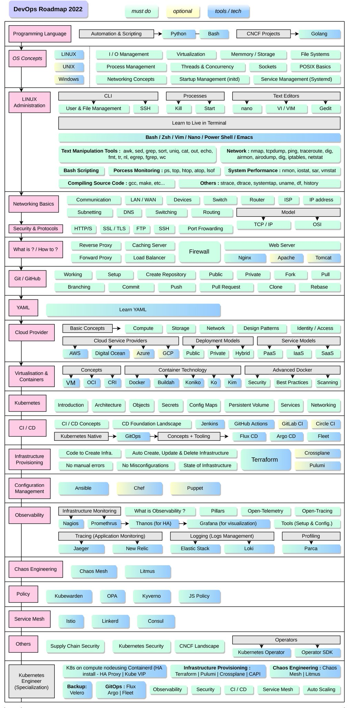
[Credit: Javarevisited](https://twitter.com/javarevisited/status/1571008182176161793?s=20&t=qUBknUxyULxEtnFGMXM7EQ)

Twitter Thread: [4 things to make a difference as a GM](https://twitter.com/isfridayTV/status/1572987318860140546?s=20&t=D0p-ZP4RKMFuT4Gm8tRu3g)

Twitter Thread: [Tracking a car using its license plate](https://twitter.com/intidc/status/1574263808607997953?s=20&t=D0p-ZP4RKMFuT4Gm8tRu3g)

Career: [Security Certification Roadmap](https://pauljerimy.com/security-certification-roadmap/)

Career: [Security Engineer Interview Questions](https://github.com/tadwhitaker/Security_Engineer_Interview_Questions/blob/master/security-interview-questions.md)

Video: Programming: [Object?  You keep using that word](https://www.youtube.com/watch?v=IA-RyzKE7oc)

Career: 19 Resources for Finding Remote Jobs
1. JustRemote
2. AngelList
3. LinkedIn
4. Facebook groups
5. Reddit
6. Working Nomads
7. Remotive
8. OdeskWork
9. Flexjobs 
10. Fiverr
11. Upwork
12. Dribble
13. Freelancer
14. Indeed
15. Outsourcely
16. We Work Remotely
17. Problogger
18. Freelance Writing
19. Remote
[Credit: @ihteshamit](https://twitter.com/ihteshamit/status/1577305414626050048)

Resource: [Privilege Escalation](https://github.com/Ignitetechnologies/Privilege-Escalation)

Resource: [HackTheBox CTF Writeups](https://github.com/Ignitetechnologies/HackTheBox-CTF-Writeups)

Resource: [Vulnhub CTF Writeups](https://github.com/Ignitetechnologies/Vulnhub-CTF-Writeups)

Resource: [TryHackMe CTF Writeups](https://github.com/Ignitetechnologies/TryHackMe-CTF-Writeups)

Training: [Network Security Foundations](https://www.edx.org/course/network-security-foundations)

Training: [Network Security - Advanced Topics](https://www.edx.org/course/network-security-advanced-topics)

Training: [CyberSec Fundamentals](https://www.edx.org/course/cybersecurity-fundamentals)

Training: [PenTesting - Exploitations](https://www.edx.org/course/penetration-testing-exploitation)

Training: [Introduction to CyberSec](https://www.edx.org/course/introduction-to-cybersecurity)

Training: [Computer Forensics](https://www.edx.org/course/computer-forensics)

Twitter Thread: [PenTesting Training Labs](https://twitter.com/hetmehtaa/status/1561681412515803137?s=20&t=OBzCNt_niQROiDqf-8RJmQ)

Books: [Nmap Cookbook - Beat the Beast](https://rbebooks.site/the-nmap-cookbook-beat-the-beast/)

Article: [Your Cyber Response Plan Neews These 6 Components](https://www.asisonline.org/security-management-magazine/monthly-issues/security-technology/archive/2022/october/Your-Cyber-Response-Plan-Needs-These-6-Components/)

Podcast: [ITSP Magazine](https://www.itspmagazine.com/itspmagazine-podcast-radio-hosts/deb-radcliff)

Resource: [AD PenTesting Mind Map](https://tajdini.net/blog/penetration/active-directory-penetration-mind-map/)

Resource: Network Security Illustrated
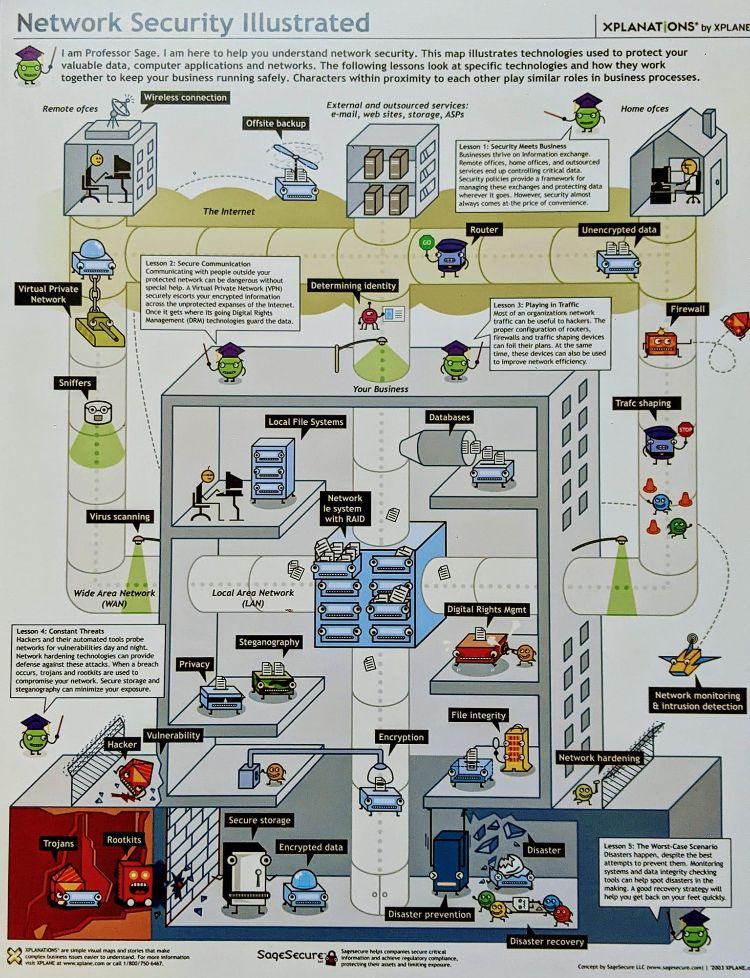
[Credit: Hacking Articles](https://twitter.com/hackinarticles/status/1571046243522183168?s=20&t=qUBknUxyULxEtnFGMXM7EQ)

Programming: Sleep Sort
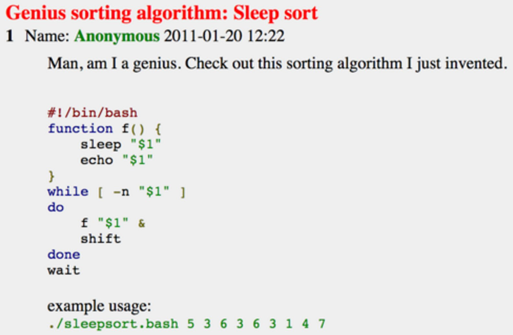
[Credit: Greg Young](https://twitter.com/gregyoung/status/1555944476786524161?s=20&t=OBzCNt_niQROiDqf-8RJmQ)

Resource: [Fancy Forensics](https://www.fancy4n6.com/resources)

Article: [How I Hacked BBC Mail Servers](https://cyberguy0xd1.medium.com/how-i-hacked-bbc-mail-servers-e61bb6faed2d)

Article: [GraphQL: Batching Attacks](https://www.whiteoaksecurity.com/blog/graphql-batching-attacks-turbo-intruder/)

Article: [Second Order IDOR Attacks](https://ozguralp.medium.com/a-less-known-attack-vector-second-order-idor-attacks-14468009781a)

Video: [Hacker hunting with Wireshark](https://www.youtube.com/watch?v=ObUgYDn1zZ0)

Twitter Thread: [CyberSec Search Engines](https://twitter.com/danielmakelley/status/1570910911078207488?s=20&t=qUBknUxyULxEtnFGMXM7EQ)

Resource: [Online OSINT Tools](https://github.com/cipher387/osint_stuff_tool_collection)

Article (PDF): [Evading AV Using Legitimate Tools](https://media.defense.gov/2022/Sep/14/2003076379/-1/-1/0/CSA_IRGC.PDF)

Article: [Forensice Detection of Files Deleted by SDelete](https://www.inversecos.com/2022/09/forensic-detection-of-files-deleted-via.html)

Resource: [Gum - For Glamourous Shell Scripts](https://github.com/charmbracelet/gum)

Resource: [wtfis](https://github.com/pirxthepilot/wtfis)

Resource: [popeye - k8s cluster resource sanitizer](https://github.com/derailed/popeye)


Resource: The Hitchhiker's Guide to DFIR
Book: [Leanpub](https://leanpub.com/TheHitchhikersGuidetoDFIRExperiencesFromBeginnersandExperts)
Resource: [GitHub](https://github.com/Digital-Forensics-Discord-Server/TheHitchhikersGuidetoDFIRExperiencesFromBeginnersandExperts)
Book: [Bookwire](https://www.bookwire.com/book/USA/the-hitchhikers-guide-to-dfir-9798986335902-andrew-rathbun-85169559)

Resource: PenTest Payloads on Email Field
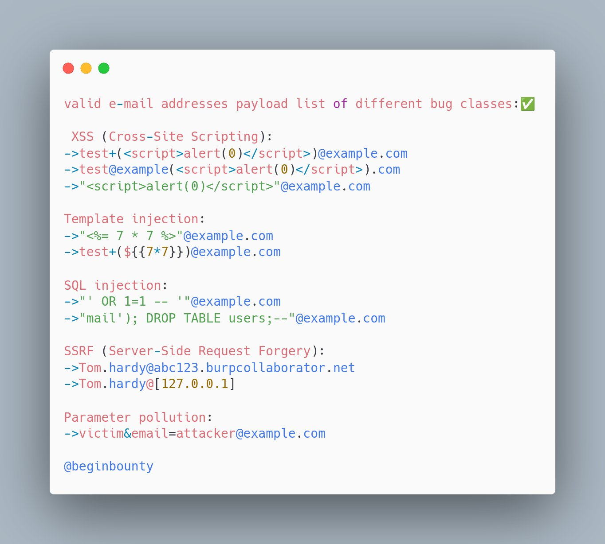
[Credit: @bughuntar](https://twitter.com/bughuntar/status/1562516221438078976?s=20&t=OBzCNt_niQROiDqf-8RJmQ)

Video: [Linux Memory Forensics](https://www.youtube.com/watch?v=Llsoo8LHhWg)

Resource: [Reverse Engineering](https://github.com/mytechnotalent/Reverse-Engineering)

Resource: How do Apple/Google Pay Handle Sensitive Card Info?
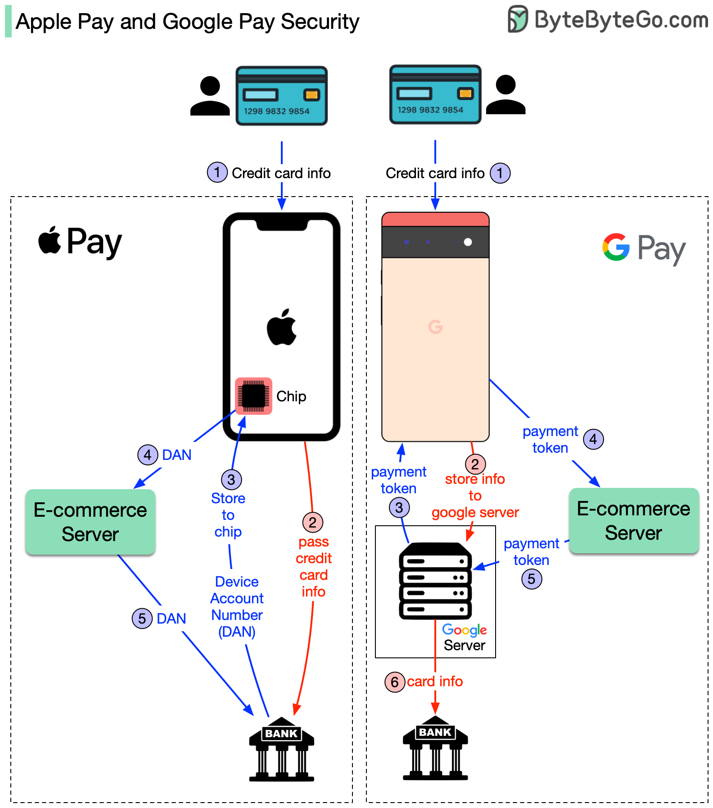
[Credit: @alexxubyte](https://twitter.com/alexxubyte/status/1572614943811440642?s=20&t=D0p-ZP4RKMFuT4Gm8tRu3g)

Article: [Duke Nukem II Source Code Reconstructed](https://blog.adafruit.com/2022/09/29/duke-nukem-ii-source-code-reconstructed-gaming-vintagecomputing-reverseengineering-lethal_guitar/)

Video: [Microservices and Rules Engines](https://www.youtube.com/watch?v=Fuac__g928E&t=6s)

Resource: [Anonymous bruteforce AD Usernames from DC by abusing LDAP ping requests](https://github.com/lkarlslund/ldapnomnom)

Resource: [CyberChef](https://github.com/gchq/cyberchef)

Training: [The Last Algorithms Course You'll Need](https://frontendmasters.com/courses/algorithms/)

Training: [Network Penetration Tester](https://certifications.tcm-sec.com/)

Training: [12 hours of Ethical Hacking](https://www.youtube.com/watch?v=fNzpcB7ODxQ)

Training: [5 hours of OSINT](https://www.youtube.com/watch?v=qwA6MmbeGNo)

Article: [Meet the men who spy on women through their webcams](https://arstechnica.com/tech-policy/2013/03/rat-breeders-meet-the-men-who-spy-on-women-through-their-webcams/)

Resource: [Free AWS Practice Labs and Resources](https://medium.com/towards-cloud-computing/7-free-aws-practice-labs-and-aws-workshops-resources-d0a861f05d3)

Programming: [Python](https://data-flair.training/python-course/)

Programming: [PCAP: Programming Essentials in Python](https://www.netacad.com/courses/programming/pcap-programming-essentials-python)

Programming: [Machine Learning Crash Course](https://developers.google.com/machine-learning/crash-course)

Programming: [Machine Learning with Python](https://cognitiveclass.ai/courses/machine-learning-with-python/)

Programming: [Introduction to Deep Learning](https://www.kaggle.com/learn/intro-to-deep-learning)

Article (Paywall): [Pentagon opens sweeping review of clandestine psychological operations](https://www.washingtonpost.com/national-security/2022/09/19/pentagon-psychological-operations-facebook-twitter/)

Podcast: [Thursday Defensive](https://us06web.zoom.us/meeting/register/tZYufu-tqzksG9c9nGOwI8OE7j8b31pR54kl?utm_campaign=Thursday%20Defensive%20Webcast&utm_content=222288292&utm_medium=social&utm_source=twitter&hss_channel=tw-4924331660)

Video: [Feynman Lectures on Physics, Vol 1](https://www.feynmanlectures.caltech.edu/I_toc.html)

Video: [Feynman Lectures on Physics, Vol 2](https://www.feynmanlectures.caltech.edu/II_toc.html)

Video: [Feynman Lectures on Physics, Vol 3](https://www.feynmanlectures.caltech.edu/III_toc.html)

Article: [Evicting the Advesary](https://www.huntress.com/blog/evicting-the-adversary)

Video: [Beginners to Advanced Bug Bounty Hunting Course](https://www.youtube.com/watch?v=Rp69edBmFFo)

Article: [Using Architce.org for OSIN Investigations](https://osintcurio.us/2021/03/03/using-archive-org-for-osint-investigations/)

Programming: [Dummy API](https://dummyapi.io/)

Programming: [Mapbox](https://www.mapbox.com/)

Programming: [Fake Store API](http://fakestoreapi.com/)

Resource: [Awesome Security Hardening](https://github.com/decalage2/awesome-security-hardening)

Resource: [NSA: K8s Hardening Guide](https://media.defense.gov/2022/Aug/29/2003066362/-1/-1/0/CTR_KUBERNETES_HARDENING_GUIDANCE_1.2_20220829.PDF)

Twitter Thread: [PenTesting Ideas](https://twitter.com/MrDamanSingh/status/1572603612949250050?s=20&t=D0p-ZP4RKMFuT4Gm8tRu3g)

Programming: [Rich - Pythong Library for Rich Text](https://github.com/Textualize/rich)

Resource: [CyberSec News Resources](https://github.com/NafisiAslH/KnowledgeSharing/blob/main/CyberSecurity/Web/BugBountyTips/HowStart/20220916%20-%2039%20cybersecurity%20news%20resources.md)

Resource: Log4Shell Mind Map
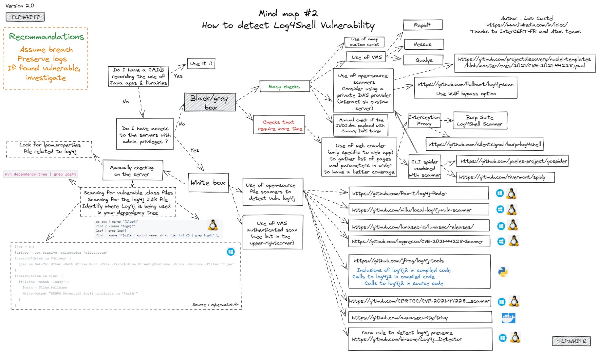
[Credit: @ManieshNeupane](https://twitter.com/ManieshNeupane/status/1573706500035739654?s=20&t=D0p-ZP4RKMFuT4Gm8tRu3g)

Resource: Search Engines for PenTesters
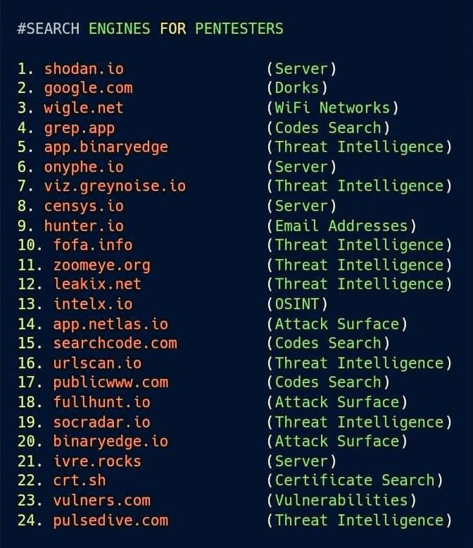
[Credit: @ManieshNeupane](https://twitter.com/ManieshNeupane/status/1569647860421099520?s=20&t=qUBknUxyULxEtnFGMXM7EQ)

Resource: Wireshark Cheatsheet

[Credit: @LetsDefendIO](https://twitter.com/LetsDefendIO/status/1579856899192692743?s=20&t=qUBknUxyULxEtnFGMXM7EQ)

Resource: SSL/TLS Handshake Process
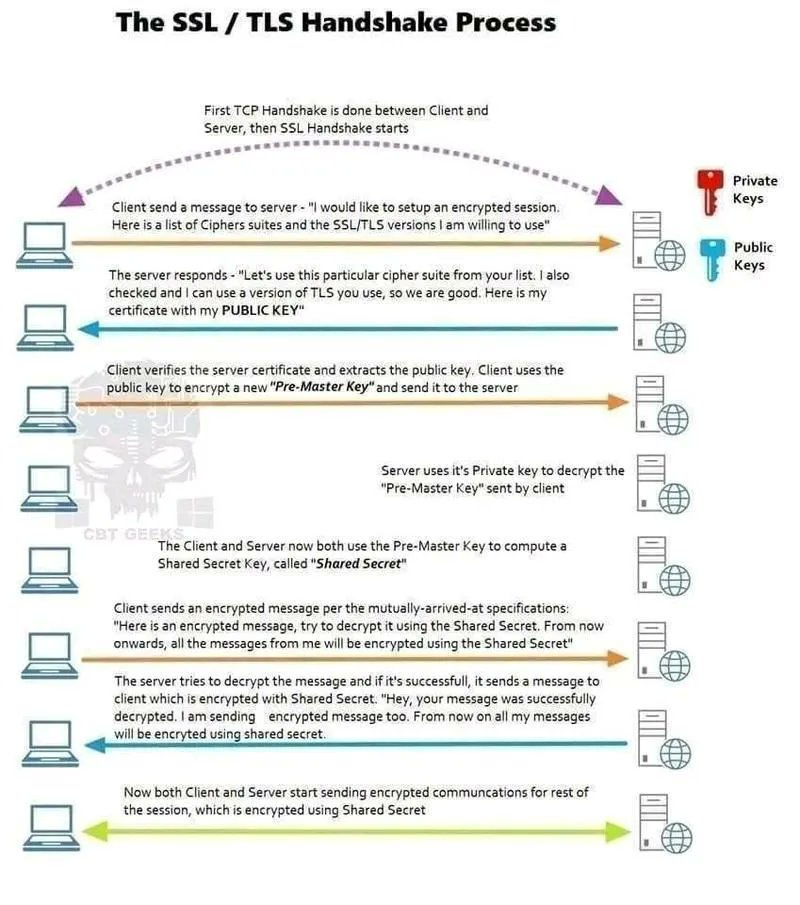
[Credit: @LetsDefendIO](https://twitter.com/LetsDefendIO/status/1576232986202324992?s=20&t=D0p-ZP4RKMFuT4Gm8tRu3g)

Training: [Windows Fundamentals](https://app.letsdefend.io/training/lessons/windows-fundamentals)

Programming: JavaScript Array CheatSheEt
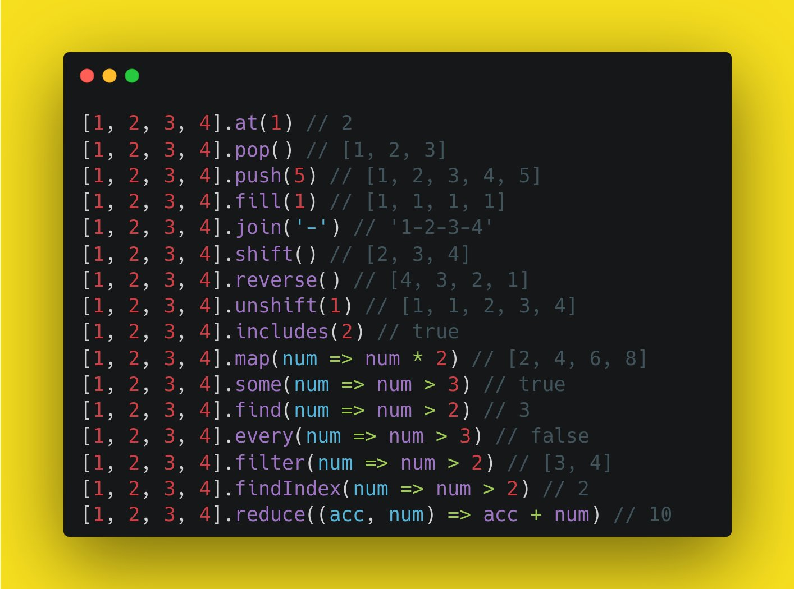
[Credit: @JS_Dojo](https://twitter.com/JS_Dojo/status/1579128446839816192?s=20&t=D0p-ZP4RKMFuT4Gm8tRu3g)

Training: [Azure Network Security Ninja Training](https://techcommunity.microsoft.com/t5/azure-network-security-blog/azure-network-security-ninja-training/ba-p/2356101)

Training: [Purview eDiscover Ninja Training](https://techcommunity.microsoft.com/t5/security-compliance-and-identity/become-a-microsoft-purview-ediscovery-ninja/ba-p/2793108)

Training: [Microsoft 365 Defender Ninja Training](https://techcommunity.microsoft.com/t5/microsoft-365-defender-blog/become-a-microsoft-365-defender-ninja/ba-p/1789376)

Training: [Microsoft Defender for Cloud Ninja](https://techcommunity.microsoft.com/t5/microsoft-defender-for-cloud/become-a-microsoft-defender-for-cloud-ninja/ba-p/1608761)

Training: [Best Hacking Tutorials in 2022](https://hakin9.org/download/best-hacking-tutorials-in-2022-preview/)

Training: [Blind XSS in Practice](https://hakin9.org/blind-xss-in-practice-advanced-bug-hunting-with-burp-suite-tutorial-free-course-content/)

Resource: [SOC Prime](https://attack.socprime.com/#!/)

Resource: [Threat Hunter Playbook](https://threathunterplaybook.com/intro.html)

Programming: Java Regex Cheatsheet
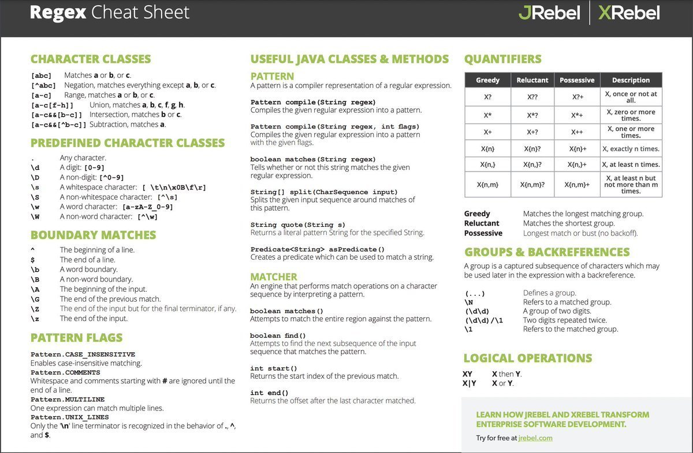
[Credit: @GuidesJava](https://twitter.com/GuidesJava/status/1572604770225098752?s=20&t=D0p-ZP4RKMFuT4Gm8tRu3g)

Resource: Microservices Design Patterns

[Credit: @GuidesJava](https://twitter.com/GuidesJava/status/1570965136134864900?s=20&t=qUBknUxyULxEtnFGMXM7EQ)

Resource: Cross-Origin Resource Sharing
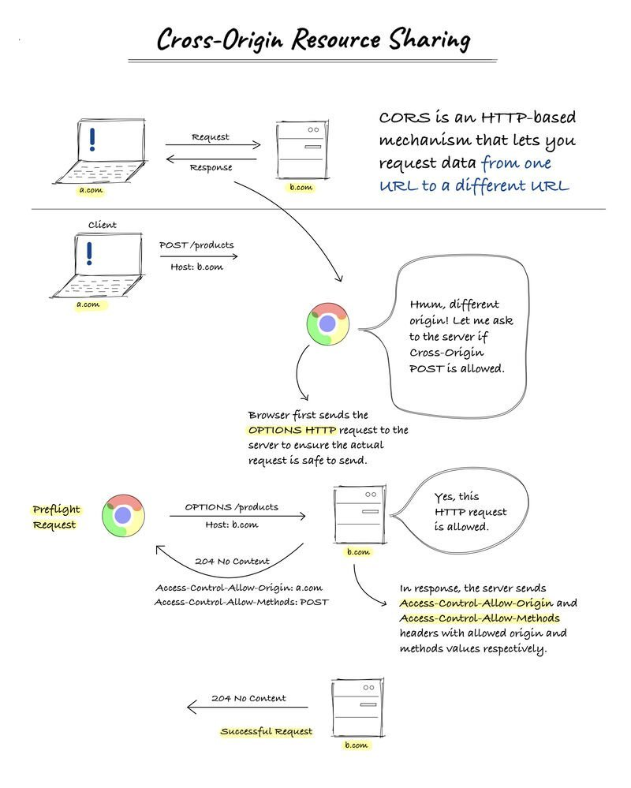
[Credit: @GuidesJava](https://twitter.com/GuidesJava/status/1570813736889495552?s=20&t=qUBknUxyULxEtnFGMXM7EQ)

Programming: Difference Between Class/Instance Variables in Java
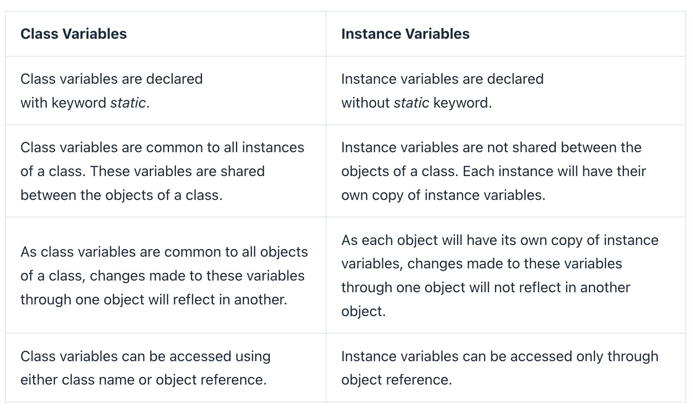
[Credit: @GuidesJava](https://twitter.com/GuidesJava/status/1570600987101888514?s=20&t=qUBknUxyULxEtnFGMXM7EQ)

Programming: Iterating a Java Map
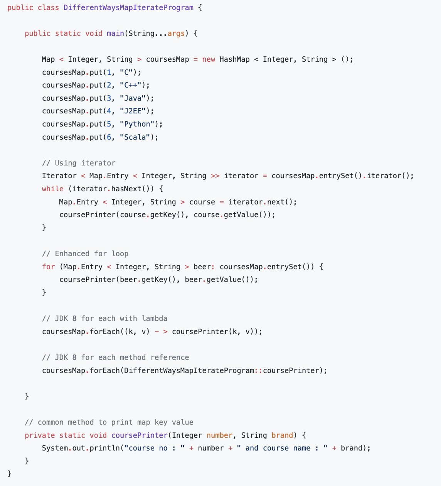
[Credit: @GuidesJava](https://twitter.com/GuidesJava/status/1570059921588109313?s=20&t=qUBknUxyULxEtnFGMXM7EQ)

Programming: Iterating a Java List
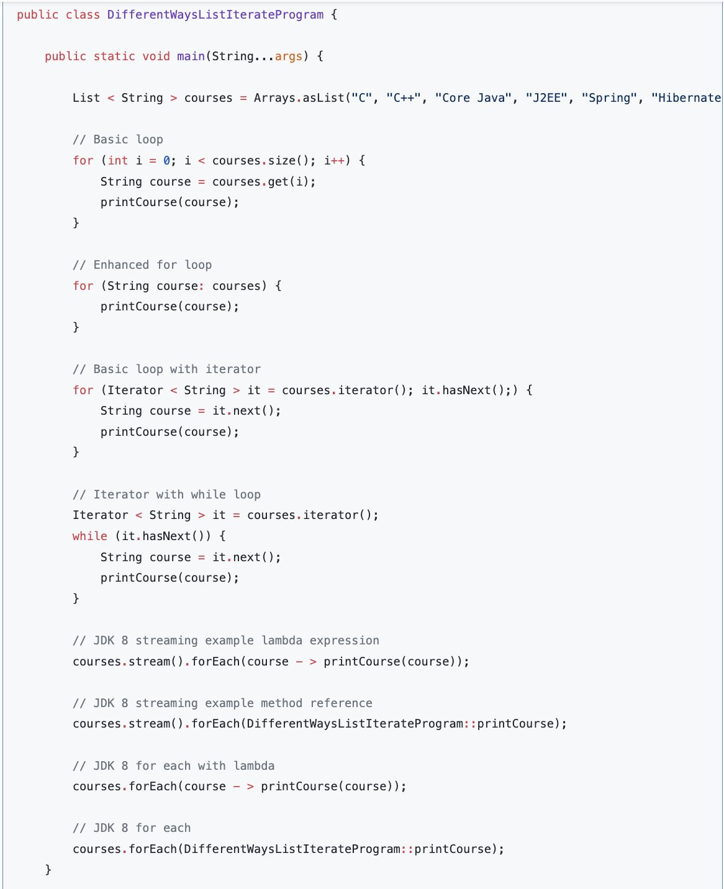
[Credit: @GuidesJava](https://twitter.com/GuidesJava/status/1569935113806565377?s=20&t=qUBknUxyULxEtnFGMXM7EQ)

Twitter Thread: [Summary of All Java 8-18 Features](https://twitter.com/GuidesJava/status/1565624060804882432?s=20&t=OBzCNt_niQROiDqf-8RJmQ)

Programming: Java Generics Cheatsheet
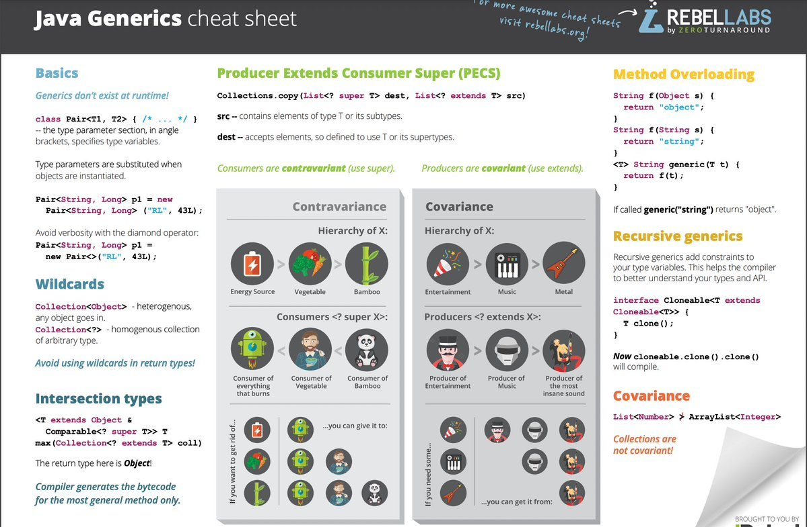
[Credit: @GuidesJava](https://twitter.com/GuidesJava/status/1564494664387833856?s=20&t=OBzCNt_niQROiDqf-8RJmQ)

Resource: JWT Authentication Flow
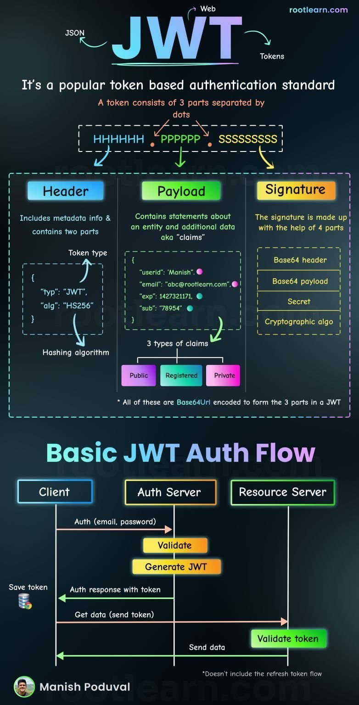
[Credit: @GuidesJava](https://twitter.com/GuidesJava/status/1563396351894757376?s=20&t=OBzCNt_niQROiDqf-8RJmQ)

Article: [CVE in VIM](https://huntr.dev/bounties/faa74175-5317-4b71-a363-dfc39094ecbb/)

Video: [12 SOC Analyst Interview Q&As](https://www.youtube.com/watch?v=YfNr1vx3lEM&t=204s)

Twitter Thread: [OSINT Toolbox for Recon](https://twitter.com/Gerald_Auger/status/1575856775781384192?s=20&t=D0p-ZP4RKMFuT4Gm8tRu3g)

Article: [Best CTF Platforms](https://infosecwriteups.com/best-ctf-platforms-876cc0870f3b)

Article: [GIFShell attack creates reverse sheel using MS Teams GIFs](https://www.bleepingcomputer.com/news/security/gifshell-attack-creates-reverse-shell-using-microsoft-teams-gifs/)

Resource: [Beginner's Guide to Obfuscation](https://github.com/BC-SECURITY/Beginners-Guide-to-Obfuscation)

Training: [Free/Affordable Malware Analysis Training](https://training.dfirdiva.com/listing-category/malware-analysis-and-re)

Video: [Getting Into the DFIR Field](https://www.youtube.com/playlist?list=PLsZo7Kc8eS0PsnWgE92MPM0PAYlTrmnMb)

Resource: [monomorph - MD5-Monomorphic Shellcode Packer](https://github.com/DavidBuchanan314/monomorph)

Podcast: [Darknet Diaries: Lisa (Insider Threads)](https://darknetdiaries.com/episode/122/)

Podcast: [Darknet Diaries: Project Raven (APT)](https://darknetdiaries.com/episode/47/)

Training: [Cyber Defense Training](https://www.mandiant.com/mandiant-gives-back/free-cyber-defense-training)

Video: [Practical Web Application Security](https://www.youtube.com/watch?v=puDzdBZZ0T4)

Article: [Offensive Lateral Movement](https://dazzyddos.github.io/posts/Offensive-Lateral-Movement/)

Article: [Ethernet VLAN Stacking flaws let hackers launch DoS, MiTM attacks](https://www.bleepingcomputer.com/news/security/ethernet-vlan-stacking-flaws-let-hackers-launch-dos-mitm-attacks/)

Resource: [PCcredz](https://github.com/lgandx/PCredz)

Resource: Quick/Dirty Linux Persistence
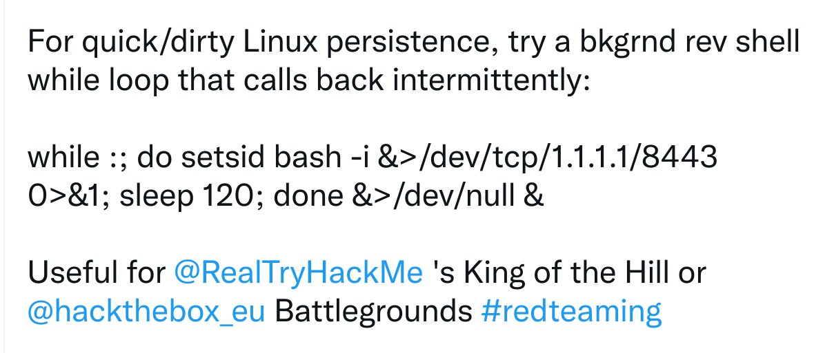
[Credit: @Alh4zr3d](https://twitter.com/Alh4zr3d/status/1579480750633947136?s=20&t=D0p-ZP4RKMFuT4Gm8tRu3g)

Resource: Linux Persistence 2
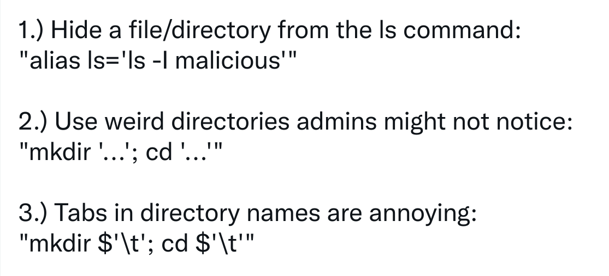
[Credit: @Alh4zr3d](https://twitter.com/Alh4zr3d/status/1579837798101946368?s=20&t=qUBknUxyULxEtnFGMXM7EQ)

Resource: Hiding SSH Connections
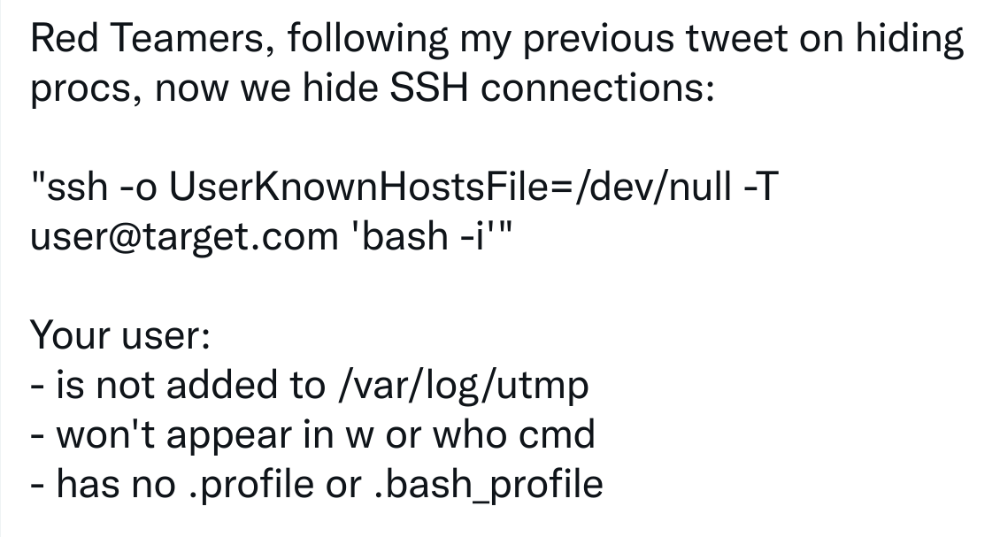
[Credit: @Alh4zr3d](https://twitter.com/Alh4zr3d/status/1578406155453276160?s=20&t=D0p-ZP4RKMFuT4Gm8tRu3g)

Training: [Malware Reverse Engineering for Beginners](https://www.intezer.com/blog/malware-analysis/malware-reverse-engineering-beginners/)

Resource: Reboot directly into BIOS
```
shutdown /r /fw /f /t 0
```
[Credit: @NetworkChuck](https://twitter.com/NetworkChuck)

Resources: [Free CyberSec Services and Tools](https://www.cisa.gov/free-cybersecurity-services-and-tools)

Article: [How I Found an SSRF](https://systemweakness.com/bug-bounty-how-i-found-an-ssrf-reconnaissance-7b1821a1b1fd)

Video: [Bypass WAF by Finding the Origin IP](https://www.youtube.com/watch?v=jfjzYpgte-A)

Resource: [JWT Simplified](https://securityzines.com/flyers/jwt.html)

Resource: Best XSS Vector
```
JavaScript://%250Aalert?.(1)//
'/*\'/*"/*\"/*`/*\`/*%26apos;)/*<!-->
</Title/</Style/</Script/</textArea/</iFrame/</noScript>
\74k<K/contentEditable/autoFocus/OnFocus=
/*${/*/;{/**/(alert)(1)}//><Base/Href=//X55.is\76-->
```
[Credit: @0x0SojalSec](https://twitter.com/0x0SojalSec/status/1579305809812807680?s=20&t=D0p-ZP4RKMFuT4Gm8tRu3g)

Resource: [Persistence mechanisms](https://persistence-info.github.io/)

Resource: [All In One Recon Tool](https://github.com/D3Ext/AORT)


